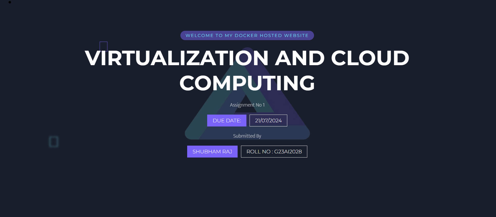

# VTIRTUALIZATION AND CLOUD COMPUTING - React Docker G23AI2028

[![Contributors][contributors-shield]][contributors-url]
[![Forks][forks-shield]][forks-url]
[![Stargazers][stars-shield]][stars-url]
[![Issues][issues-shield]][issues-url]

## Assignment Details

The project was assigned from the course **VIRTUALIZATION AND CLOUD COMPUTING**, Assignment No 1.


React Docker Web Application built with React, deployed using Docker containers. This reademe will walks you through the process of setting up, building, and running the application.

## Features

- Simple web server using Node.js and Express.
- Dockerized application with custom Dockerfile.
- Easy deployment and scaling with Docker.

## Assignment Task

- Step 1: Deploy a sample web application using docker containers by creating docker images from scratch. Existing docker container images are not allowed

- Step 2: Create a readme file with full explanation of the process followed, describe the app functionality, include details of author 

### Landing Page Hosted on Docker




## Built With

- Docker v27.0.3
- React v18.3.1
- Vite v5.3.4
- Github

## Getting Started

To get started with the app, cd to the directory where you would like the repo to live by typing on your terminal:

```
$ cd <directory>
```

# Clone the repo typing:

```
$ git clone git@github.com:shubham14p3/react-docker-g23ai2028.git
```

# Step 1: Install the needed package:

```
$ npm i
```

# Step 2: Build the Docker Image

```
$ docker build -t react-docker-g23ai2028 .

```

# Step 3: Check Docker images

```
$ docker images
```
# Step 4: Run the Docker Container

```
$ docker run -p 5173:5173 react-docker-g23ai2028
```

Finally, docker is ready on the port 5173:

```
Open below link in your browser.
Local:   http://localhost:5173/
Network: http://172.17.0.2:5173/
```

## Extra Knowledge: Setting up Docker in local

Create new file Dockerfile and place the below code

```
# Use an official Node.js runtime as a parent image
FROM node:20-alpine

# Set the working directory in the container
WORKDIR /app

# Copy package.json and package-lock.json
COPY package*.json .

# Install dependencies
RUN npm install

# Copy the rest of the application code
COPY . .

# Expose the port the app runs on
EXPOSE 5173

# Define the command to run the app
CMD [ "npm","run","dev" ]
```
Create new file `.dockerignore` to ignore larger file from the Image similar to .gitignore

### Prerequisites (Minimum)

- NodeJS
- Docker
- Github

### Refereces

- [Docker](https://docs.docker.com/guides/getting-started/)
- [React](https://react.dev/learn)
- [Vite](https://vitejs.dev/guide/)

## Authors

👤 **Shubham Raj**

- Github: [@ShubhamRaj](https://github.com/shubham14p3)
- Linkedin: [Shubham14p3](https://www.linkedin.com/in/shubham14p3/)
- Roll No - G23AI2028


## 🤝 Contributing

Contributions, issues and feature requests are welcome!

Feel free to check the [issues page](https://github.com/shubham14p3/react-docker-g23ai2028/issues).

## Show your support

Give a ⭐️ if you like this project!

## Acknowledgments

- Project requested by [IITJ](https://www.iitj.ac.in/).

<!-- MARKDOWN LINKS & IMAGES -->

[contributors-shield]: https://img.shields.io/github/contributors/shubham14p3/members-only.svg?style=flat-square
[contributors-url]: https://github.com/shubham14p3/react-docker-g23ai2028/graphs/contributors
[forks-shield]: https://img.shields.io/github/forks/shubham14p3/members-only.svg?style=flat-square
[forks-url]: https://github.com/shubham14p3/react-docker-g23ai2028/network/members
[stars-shield]: https://img.shields.io/github/stars/shubham14p3/members-only.svg?style=flat-square
[stars-url]: https://github.com/shubham14p3/react-docker-g23ai2028/stargazers
[issues-shield]: https://img.shields.io/github/issues/shubham14p3/members-only.svg?style=flat-square
[issues-url]: https://github.com/shubham14p3/react-docker-g23ai2028/issues
